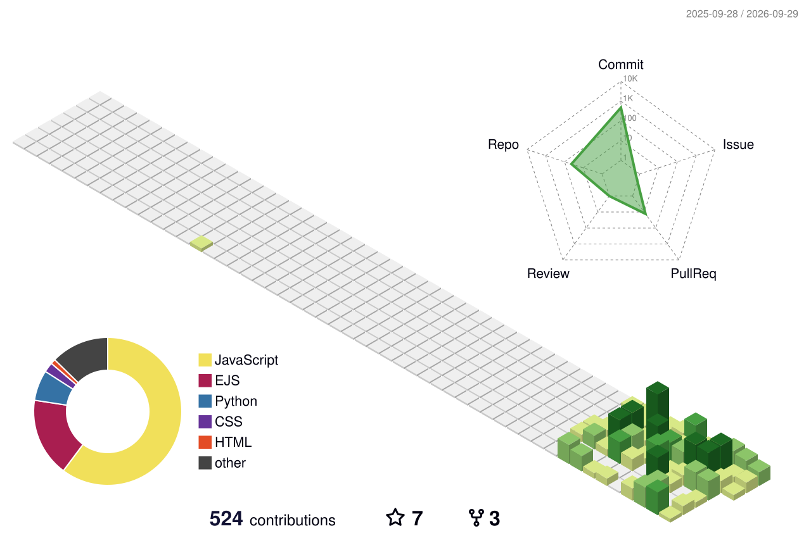

<table>
<tr>
<td width="55%" valign="middle">

### Hassan El Maayati

*Make it work, then make it better.*

</td>
<td width="45%">

</td>
</tr>
</table>

 

## Background

**Software Engineering Graduate** — [University of Bahrain](https://cit.uob.edu.bh/undergraduate/b-sc-in-software-engineering/) · [General Assembly](https://ga-public-downloads.s3.us-east-1.amazonaws.com/06.200.030+SEB+Full-Time+Bootcamp+syllabus.pdf)

 

 

## Tech Stack

**Languages**
 

**Frontend**
 

**Backend & APIs**
 

**Databases**
 

**Auth & Cloud Services**
 

**DevOps & Deployment**
 

**Testing**
 

**Tools & OS**
 

<picture>
  <source media="(prefers-color-scheme: dark)" srcset="https://raw.githubusercontent.com/hassanelmaayati/hassanelmaayati/output/github-contribution-grid-snake-dark.svg" />
  <source media="(prefers-color-scheme: light)" srcset="https://raw.githubusercontent.com/hassanelmaayati/hassanelmaayati/output/github-contribution-grid-snake.svg" />
  
</picture>

 

---
